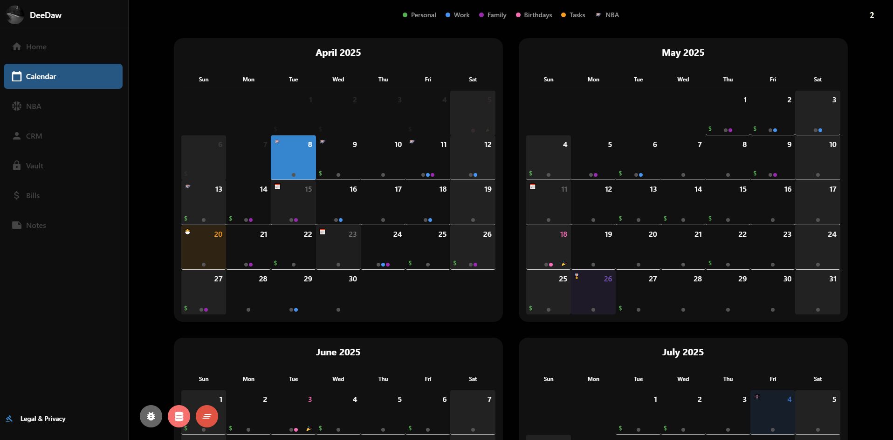
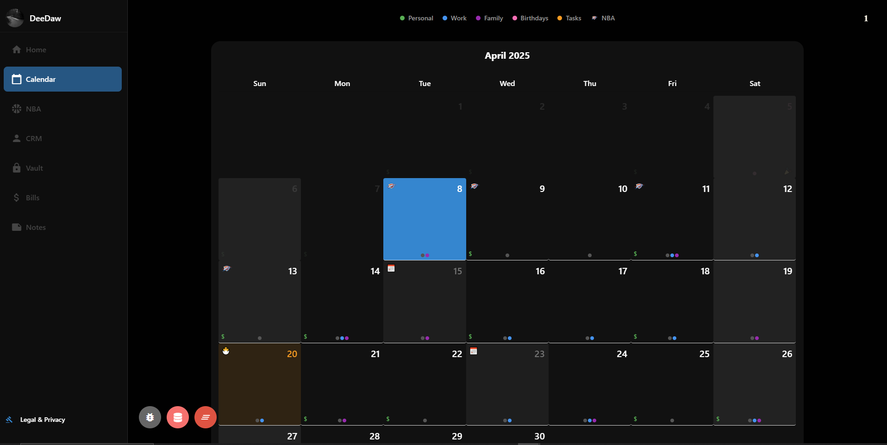
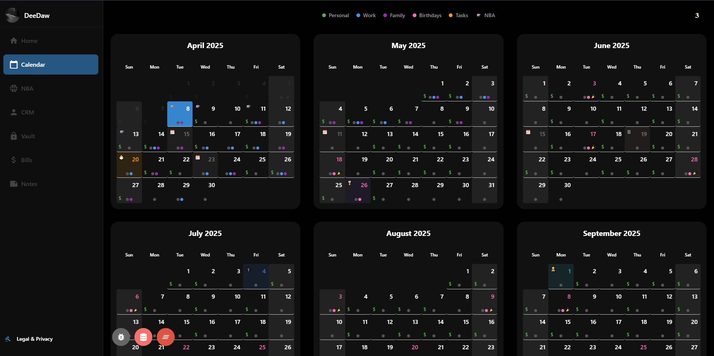

<div style="display: flex; gap: 2px; margin-bottom: 20px; overflow-x: auto;">
  
  
  
  
  
</div>

<h1 style="display: flex; align-items: center; margin-bottom: 20px;">
  
  Kaiba Nexus
</h1>

<div style="display: flex; justify-content: space-around; margin-bottom: 30px;">
  <a href="https://kaiba.vercel.app/" style="text-decoration: none; padding: 0 15px;">Web Version</a>
  <a href="https://apps.apple.com/us/app/kaiba-nexus/id6743065823" style="text-decoration: none; padding: 0 15px;">Download on App Store</a>
  <a href="https://deedaw.cc/pages/privacy.html" style="text-decoration: none; padding: 0 15px;">Privacy Policy</a>
</div>

A feature-rich personal dashboard app built with React Native and Expo, designed to help you manage your life with style.

## Features

- **📝Notes**: Create rich notes with with Markdown formatting and drag-and-drop organization
- **✅Todo List**: Manage tasks with recurring, one-time todos, priority levels, and categories
- **📅Calendar**: Track birthdays, bills, events, and more
- **👤CRM**: Manage contacts with attributes like Payment Methods, Addresses, Birthdays (recieve notifications on day of to remind you to wish them a happy birthday)
- **🔒Password Vault**: Securely store passwords locally using Cryptograpgy
- **💰Finance Tracking**: Monitor portfolio with real-time stock updates
- **🔄Year Progress Bar**: Visualize the current year's progress
- **🌤️Weather**: 5 Day forecast with animations and current temp! 
- **🌐Network**: Check your network speed and ping right from the app
- **🏀NBA**: Follow your favorite teams' schedules
- **🎨Customization**: Choose your favorite wallpaper and color scheme

**Coming Soon**: Cross-Device Sync with TinyBase integration


## 🚀 Getting Started

### Prerequisites

- Node.js 
- Yarn (recommended) or npm
- Expo CLI

### Installation

```bash
# Clone the repository
git clone https://github.com/dpope32/frosting.git
cd frosting

# Install dependencies (Yarn recommended)
yarn install
```

### Running the App

#### Mobile (iOS/Android)
```bash
# For iOS
npx expo run:ios

# For Android
npx expo run:android
```

#### Web Version
```bash
# Start with proxy server (recommended)
npx start web-dev

# See PROXY_SERVER.md for details on proxy setup
```

## Development Stack

| Category           | Technology       |
|--------------------|------------------|
| Framework          | Expo + React Native |
| UI Components      | Tamagui          |
| State Management   | Zustand          |
| Data Fetching      | React Query      |
| Testing            | Jest             |
| Web Hosting        | Vercel           |
| Updates            | Expo OTA Updates |

## License

MIT License - see [LICENSE](LICENSE) for details.

<div style="display: flex; flex-direction: column; gap: 20px; margin-top: 30px;">
  
  
  
</div>
