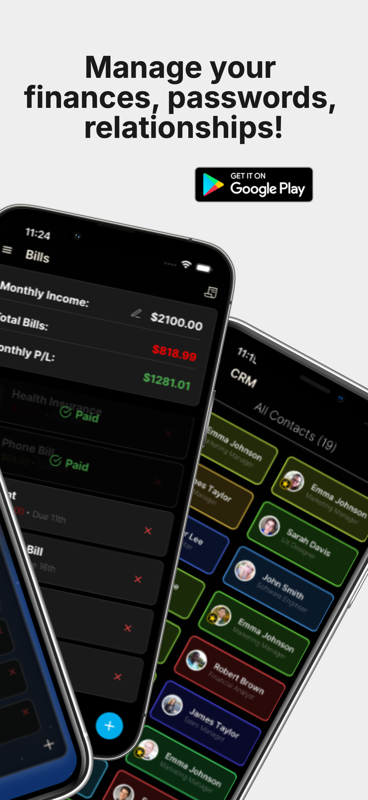

<div style="display: flex; gap: 2px; margin-bottom: 20px; overflow-x: auto;">
  
  
  
  
  
</div>

<h1 style="display: flex; align-items: center; margin-bottom: 20px;">
  
  Kaiba - Nexus
</h1>

<div style="display: flex; flex-direction: row; align-items: flex-start; gap: 10px; width: 100%; margin-bottom: 30px;">
  <div style="padding: 10px 10px;"><a href="https://kaiba.vercel.app/" style="text-decoration: none;">Web Version</a></div>
  <div style="padding: 10px 10px;"><a href="https://apps.apple.com/us/app/kaiba-nexus/id6743065823" style="text-decoration: none;">Download on App Store</a></div>
  <div style="padding: 10px 10px;"><a href="https://deedaw.cc/pages/privacy.html" style="text-decoration: none;">Privacy Policy</a></div>
</div>

Kaiba - Nexus is a free, feature-rich personal management app built with to organize your life, designed local first. 
- **Sync Engine**: Seamlessly synchronize your data across all your devices with our powerful sync engine. Only available to premium users.
- **Offline Capability**: Built with a local-first approach, the app works fully offline. It pulls the latest information on startup and saves all your data when closed
- **Customizable Sync**: You have complete control over what data gets synchronized. Choose exactly which modules to sync across your devices
- **Privacy-First Design**: All data is encrypted at rest and in transit using AES-256 cryptography. Your information remains private - even we can't access it. Your devices are the only machines with the key to decrypt your data. Note: This security model means we cannot help recover data if you lose all your devices. Premium users with multiple devices effectively have "backups" of their data.

## Features

- **📝Notes**: Create rich notes with with Markdown formatting and drag-and-drop organization
- **✅Todo List**: Manage tasks with recurring, one-time todos, priority levels, and categories
- **📅Calendar**: Track birthdays, bills, events, sync with native device calendar, and more
- **👤CRM**: Manage contacts with attributes like Payment Methods, Addresses, Birthdays (recieve notifications on day of to remind you to wish them a happy birthday)
- **🔒Password Vault**: Securely store passwords locally using Cryptograpgy
- **💰Finance Tracking**: Monitor portfolio with real-time stock updates and a screen to manage your bills (comes in handy with spouses syncing their bills!)
- **🔄Year Progress Bar**: Visualize the current year's progress
- **🌤️Weather**: 5 Day forecast with animations and current temp! 
- **🌐Network**: Check your network speed and ping right from the app
- **🏀NBA**: Follow your favorite teams' schedules (deprecated during offseason)
- **🏆Project Tracker**: Track your projects, attach other people, notes, pictures, and more
- **☑️HabitTracker** Track your habits, recieve notification reminders on mobile
- **🎨Customization**: Choose your favorite wallpaper and color scheme

**Premium**: 
- Coming soon for $3/month (or $49.99 lifetime)
1. Cross-Device Sync (all encrypted with AES-256 of course)
2. Unlimited Devices 
3. Choose what you want to sync (Notes, Todos, Calendar, CRM, Password Vault, Stocks, Habits, Projects)


## 🚀 Getting Started

### Prerequisites

- Node.js 
- Yarn (recommended) or npm
- Expo CLI

### Installation

```bash
# Clone the repository
git clone https://github.com/dpope32/frosting.git
cd frosting

# Install dependencies (Yarn recommended)
yarn install
```

### Running the App

#### Mobile (iOS/Android)
```bash
# For iOS
npx expo run:ios

# For Android
npx expo run:android
```

#### Web Version
```bash
# Start with proxy server (recommended)
npx start web-dev

# See PROXY_SERVER.md for details on proxy setup
```

## Development Stack

| Category           | Technology          |
|--------------------|---------------------|
| Framework          | Expo + React Native |
| UI Components      | Tamagui             |
| State Management   | Zustand             |
| Data Fetching      | React Query         |
| Testing            | Jest                |
| Web Hosting        | Vercel              |
| Updates            | Expo OTA Updates    |

## License

MIT License - see [LICENSE](LICENSE) for details.

## Web Features
<div style="display: flex; gap: 10px; margin-bottom: 20px; overflow-x: auto;">
  <video controls autoplay loop muted playsinline style="height: 380px; width: auto; object-fit: cover;">
    <source src="assets/videos/hero-ambient-1.mp4" type="video/mp4">
    Your browser does not support the video tag.
  </video>
</div>

## Mobile Features
<div style="display: flex; gap: 10px; margin-bottom: 20px; overflow-x: auto;">
  <video controls autoplay loop muted playsinline style="height: 300px; width: auto; object-fit: cover;">
    <source src="assets/videos/mobilehomescreen.mp4" type="video/mp4">
    Your browser does not support the video tag.
  </video>
  <video controls autoplay loop muted playsinline style="height: 300px; width: auto; object-fit: cover;">
    <source src="assets/videos/calVaultBillsMobile.mp4" type="video/mp4">
    Your browser does not support the video tag.
  </video>
  <video controls autoplay loop muted playsinline style="height: 300px; width: auto; object-fit: cover;">
    <source src="assets/videos/notesMobile.mp4" type="video/mp4">
    Your browser does not support the video tag.
  </video>
  <video controls autoplay loop muted playsinline style="height: 300px; width: auto; object-fit: cover;">
    <source src="assets/videos/syncmobile.mp4" type="video/mp4">
    Your browser does not support the video tag.
  </video>
  <video controls autoplay loop muted playsinline style="height: 300px; width: auto; object-fit: cover;">
    <source src="assets/videos/habitsAndProjectsMobile.mp4" type="video/mp4">
    Your browser does not support the video tag.
  </video>
  <video controls autoplay loop muted playsinline style="height: 300px; width: auto; object-fit: cover;">
    <source src="assets/videos/hero-2.mp4" type="video/mp4">
    Your browser does not support the video tag.
  </video>
   <video controls autoplay loop muted playsinline style="height: 300px; width: auto; object-fit: cover;">
    <source src="assets/videos/hero-3.mp4" type="video/mp4">
    Your browser does not support the video tag.
  </video>
</div>

## Contributing

Contributions are welcome! Please open an issue or submit a pull request. 

## CI/CD Workflows

This project uses GitHub Actions for continuous integration and deployment:

- **Version Sync**: Automatically updates Android's build.gradle versionName to match the version in app.json when app.json changes
- **Expo Doctor**: Runs npx expo-doctor on every push to verify project configuration health
- **Dependency Check**: Runs yarn install on every push and pull request to ensure dependencies are properly installed


## License

This project is licensed under the [Creative Commons Attribution-NonCommercial 4.0 International License](https://creativecommons.org/licenses/by-nc/4.0/).  
You may fork, modify, and submit pull requests, but **commercial use is strictly prohibited** and **credit is required**.
