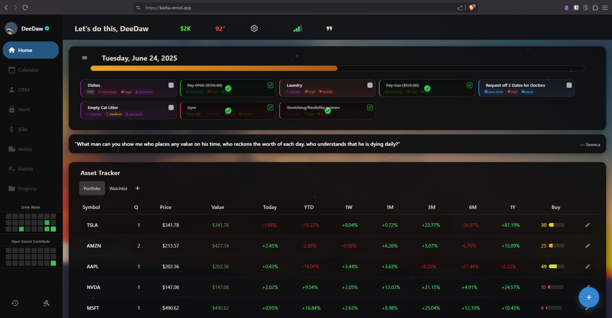

<div style="display: flex; flex-direction: column; gap: 0; margin-bottom: 20px;">
  <div style="display: flex; gap: 0; overflow-x: auto;">
    
    
    
    
    
  </div>
</div>

<div style="display: flex; justify-content: space-between; margin-bottom: 30px;">
  <a href="https://kaiba.vercel.app/" style="display: flex; align-items: center; gap: 8px; text-decoration: none;">
    
    <span>Web Version</span>
  </a>
  <a href="https://apps.apple.com/us/app/kaiba-nexus/idXXXXXXXXXX" style="display: flex; align-items: center; gap: 8px; text-decoration: none;">
    
    <span>Download on App Store</span>
  </a>
  <a href="https://deedaw.cc/pages/privacy.html" style="display: flex; align-items: center; gap: 8px; text-decoration: none;">
    
    <span>Privacy Policy</span>
  </a>
</div>

# Kaiba Nexus

A feature-rich personal dashboard app built with React Native and Expo, designed to help you manage your life with style.

## ✨ Features

- **📝 Notes with Markdown Support**: Create rich notes with markdown formatting and drag-and-drop organization
- **✅ Todo List**: Manage tasks with recurring and one-time todos
- **📅 Calendar**: Track birthdays, bills, events, NBA schedules, and more
- **👥 CRM**: Manage contacts with attributes like Payment Methods, Addresses, etc
- **🔐 Password Vault**: Securely store passwords locally
- **📊 Finance Tracking**: Monitor portfolio with real-time stock updates
- **⏳ Year Progress Bar**: Visualize your year's progress
- **🌦️ Weather & Network**: Check conditions and network status
- **🏀 NBA**: Follow your favorite teams' schedules
- **🎨 Customization**: Choose from wallpapers, themes, and more

**👀 Coming Soon**: Cross-Device Sync with TinyBase integration



## 🚀 Getting Started

### Prerequisites

- Node.js 
- Yarn (recommended) or npm
- Expo CLI

### Installation

```bash
# Clone the repository
git clone https://github.com/dpope32/frosting.git
cd frosting

# Install dependencies (Yarn recommended)
yarn install
```

### Running the App

#### Mobile (iOS/Android)
```bash
# For iOS
npx expo run:ios

# For Android
npx expo run:android
```

#### Web Version
```bash
# Start with proxy server (recommended)
yarn web-dev

# See PROXY_SERVER.md for details on proxy setup
```

## Development Stack

| Category           | Technology       |
|--------------------|------------------|
| Framework          | Expo + React Native |
| UI Components      | Tamagui          |
| State Management   | Zustand          |
| Data Fetching      | React Query      |
| Testing            | Jest             |
| Web Hosting        | Vercel           |
| Updates            | Expo OTA Updates |

## 📜 License

- **Updates**: Seamless OTA updates via Expo
- **Coming Soon**: TinyBase for cross-platform sync

## 📜 License

MIT License - see [LICENSE](LICENSE) for details.
