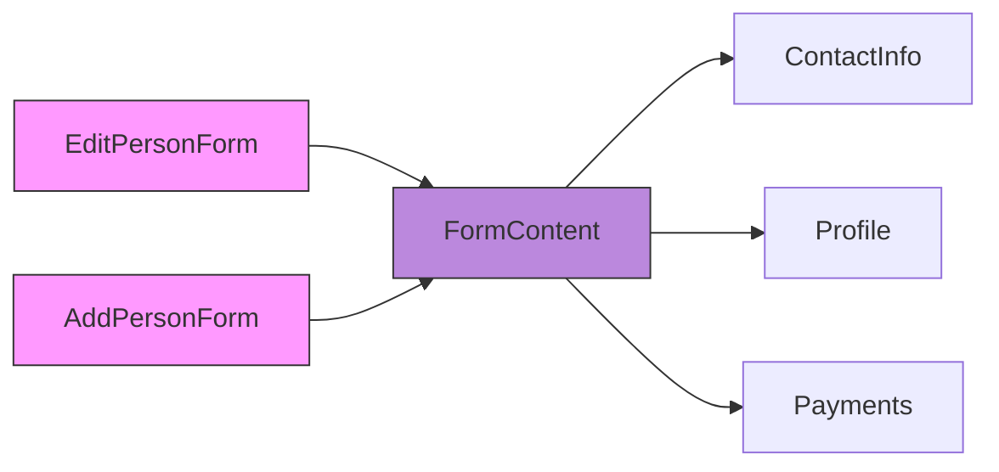

# Active Context

## Current Focus
- Refining feature set for the public release.
- Setting up Electron for Desktop Applications
- Testing UI responsiveness across web, ios, and android
- Exploring the feasibility of syncing Zustand stores via PocketBase/Supabase.

## Recent Changes (Wallpaper Optimization - March 28, 2025)
- **Fixed Slow Switching (Onboarding):** Resolved significant delays in `app/screens/onboarding/step3.tsx` by removing redundant wallpaper downloads/caching on button press. The component now loads the selected wallpaper directly from the `WallpaperStore` cache.
- **Optimized Preloading:** Refined `components/wpPreload.tsx` to correctly `await` the asynchronous cache check (`getCachedWallpaper`) within `Promise.all`, ensuring efficient parallel preloading without redundant downloads. Removed unused `WallpaperPreloader` component.
- **Consolidated Caching:** Removed redundant web-specific caching logic from `store/WallpaperStore.ts` as preloading now handles this. Added checks to `cacheWallpaper` to prevent re-downloading already existing files on native platforms.
- **Improved Landing Page Display:** Updated `components/home/BackgroundSection.tsx` to correctly read the selected style from `UserStore`, handle Zustand store hydration (`hydrated` flag), add a loading state, and reliably fetch the cached wallpaper URI.
- **Refined Types:** Updated `FormData['backgroundStyle']` in `types/index.ts` to use a template literal (`wallpaper-${string}` | 'gradient') for accurate dynamic wallpaper naming.
- **Splash Screen:** Ensured `app/_layout.tsx` hides the splash screen appropriately after fonts are loaded and potential updates are checked.

## Recent Changes (StarsBackground Extraction - March 31, 2025)
- **Extracted Stars Animation:** Created reusable `components/shared/StarsBackground.tsx` component to encapsulate all stars animation logic previously in `app/screens/onboarding/step3.tsx`.
- **Optimized Imports:** Removed unused imports (`useWindowDimensions`, `useColorScheme`) from the new component.
- **Maintained Functionality:** Preserved all original animation behavior across platforms (web, iOS, Android).
- **Reduced Step3 Size:** Removed ~150 lines of code from step3.tsx by using the new component.

## Recent Changes (Web Onboarding Welcome Screen - March 29, 2025)
- **Added Web Welcome Screen:** Created `app/screens/onboarding/welcome.tsx` to display a welcome message and privacy notice specifically for web users before the main onboarding flow begins. Includes a simple cursor-following animation for the app icon.
- **Updated Onboarding Logic:** Modified `app/screens/onboarding/index.tsx` to conditionally render the new `WelcomeScreen` as the first step (`step = -2`) only when `Platform.OS === 'web'`. Adjusted step transitions and back button logic accordingly. Fixed related TypeScript errors.

## Recent Changes (Calendar View Improvements - April 1, 2025)
- **Responsive Sizing:** Updated calendar to dynamically adjust element sizes based on column count
- **Single-Column Optimizations:**
  - Increased day numbers 
  - Increased day names 
  - Increased holiday/birthday icons 
  - Increased NBA logo 
- **Width Adjustments:**
  - 3 columns: 33% width
  - 2 columns: 45% width (changed from 49%)
  - 1 column: 80% width (changed from 100%)

## Recent Changes (NewTaskModal Improvements - April 1, 2025)
- **Animation Improvements:**
  - Added platform-specific close delays to BaseCardAnimated
  - Implemented smooth animations for web with proper timing
  - Maintained fast response on mobile
- **Toast Integration:**
  - Ensured toast visibility before modal closes
  - Added proper timing between toast display and modal close

## Recent Changes (Modal Refactor & CRM Header - April 3, 2025)
- **Created `BaseCardWithRecommendationsModal`:** Abstracted common modal structure with a horizontal recommendation scroll view (`components/cardModals/BaseCardWithRecommendationsModal.tsx`). Includes basic gesture handling setup to allow horizontal scrolling within the modal without triggering the vertical close gesture.
- **Refactored Modals:** Updated `TaskListModal`, `BillsListModal`, and `VaultListModal` to use the new `BaseCardWithRecommendationsModal`, removing redundant code and standardizing structure.
- **Added `PeopleListModal`:** Created a new modal (`components/cardModals/PeopleListModal.tsx`) using the base component to display CRM contacts. Includes placeholder recommendations.
- **Updated Header:** Modified `components/Header.tsx` to display a "people" icon and trigger the `PeopleListModal` when the CRM screen (`app/(drawer)/crm.tsx`) is active.

## Immediate Tasks
- Test gesture handling in refactored modals (`TaskListModal`, `BillsListModal`, `VaultListModal`) to ensure horizontal scroll works smoothly without closing the modal.
- Refine recommendations for `PeopleListModal`.
- Continue performance improvements and dependency reduction across other modules.
- Address known issues listed in `progress.md`.
- Continue exploring cross-device sync solutions (PocketBase/Supabase).

### Current Form Architecture Refactor

Key improvements:
- Eliminated duplicate form logic between Add/Edit variants
- Created dedicated section components (ContactInfo, Profile, Payments)
- Implemented shared DebouncedInput component with proper TypeScript typing
- Standardized state management between form variants
- Improved mobile/web responsive layouts

## Recent Changes (Notes Drag & Drop - April 9, 2025)
- **Implemented Cross-Platform Drag & Drop:** Added functionality to reorder notes using platform-specific libraries (`react-dnd` for web, `react-native-draggable-flatlist` for mobile).
- **Architectural Changes:**
    - Created `WebDragDrop.tsx` for web-specific logic, including lazy-loading of `react-dnd`.
    - Developed `DraggableNote` compound component for handling drag interactions and visual feedback.
    - Enhanced `NoteCard` to support dragging states.
- **State Management:** Integrated reordering logic with `NoteStore` using optimistic updates and persistence via AsyncStorage.
- **UX Improvements:** Added visual cues (scaling, opacity, shadows) during drag operations. Ensured responsive behavior.
