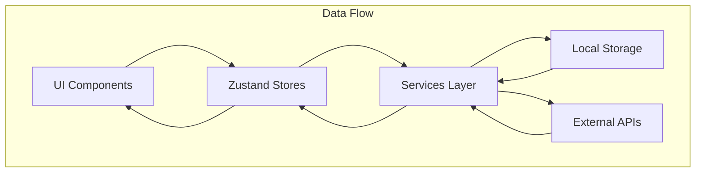

# System Patterns

## Architecture Overview
Kaiba-Nexus is built as a cross-platform application using React Native, Expo, and Electron, with a focus on local-first data storage and optional synchronization.

## Key Design Patterns

### State Management
- **Zustand**: Used for global state management across the application
- **Store Pattern**: Separate stores for different domains (BillStore, CalendarStore, PortfolioStore, etc.)
- **AsyncStorage**: Persistent storage for app data with synchronization capabilities

### Component Architecture
- **Functional Components**: React functional components with hooks
- **Component Composition**: Building complex UIs from smaller, reusable components
- **Theming**: Theme-aware components that adapt to user preferences

### Navigation
- **Expo Router**: File-based routing system for navigation
- **Drawer Navigation**: Main navigation pattern for mobile interfaces
- **Tab-based Navigation**: Used for sub-sections within major features

### Data Services
- **Service Layer**: Abstraction for data operations (billServices, calendarService, etc.)
- **API Integration**: Services for external data (weatherServices, stockSearchService)
- **Local-First**: Prioritizing local storage with optional cloud synchronization

## Cross-Platform Strategy
- **Responsive Design**: Adapting UI for different screen sizes and orientations
- **Platform-Specific Code**: Using platform detection for optimized experiences
- **Web Optimizations**: Special considerations for web version (useColorScheme.web.ts)
- **Electron Integration**: Desktop application support via Electron

## Technical Decisions

### Local Storage
- AsyncStorage for persistent data across app restarts
- Structured data models for different domains (bills, calendar events, contacts)
- **Wallpaper Caching:**
    - Wallpapers are preloaded during onboarding (`components/wpPreload.tsx`) using `Promise.all` for parallel downloads.
    - `store/WallpaperStore.ts` manages the cache.
    - **Native:** Uses `expo-file-system` to download and store wallpapers locally in the cache directory (`FileSystem.cacheDirectory + 'wallpapers/'`). Checks for existing files before downloading.
    - **Web:** Stores the remote S3 URI directly in the Zustand store cache.
    - Components (`BackgroundSection.tsx`, `onboarding/step3.tsx`) retrieve the appropriate URI (local file or remote) from the store cache.

### External Services
- Weather API integration for current conditions
- Stock data APIs for portfolio tracking
- NBA and sports data integration

### Authentication & Security
- Local authentication for sensitive areas (password vault)
- Investigating lightweight auth solutions for cross-device sync
- Privacy-first approach with minimal data collection

### Deployment
- iOS App Store and Google Play Store for mobile
- Web deployment for browser access
- Electron packaging for desktop applications
