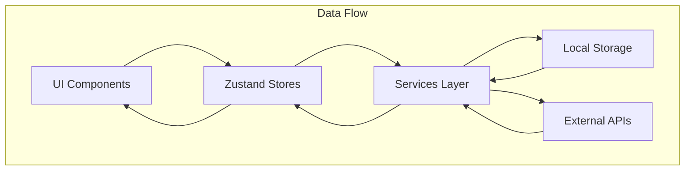

# System Patterns

## Architecture Overview
Kaiba-Nexus is built as a cross-platform application using React Native, Expo, and Electron, with a focus on local-first data storage and optional synchronization.

## Key Design Patterns

### Error Handling
- **ErrorBoundary**: A React component (`components/shared/ErrorBoundary.tsx`) wraps the main application layout (`app/_layout.tsx`) to catch JavaScript rendering errors in the component tree, log them, and display a fallback UI instead of crashing the app (March 30, 2025).

### State Management
- **Zustand**: Used for global state management across the application
- **Store Pattern**: Separate stores for different domains (BillStore, CalendarStore, PortfolioStore, WallpaperStore, etc.)
- **AsyncStorage**: Persistent storage for app data with synchronization capabilities
- **Cross-Store Integration**: Stores interact with each other through services (e.g., Task-Calendar synchronization)

### Component Architecture
- **Functional Components**: React functional components with hooks
- **Component Composition**: Building complex UIs from smaller, reusable components
- **Shared Components**: Extraction of common UI elements (e.g., `DebouncedInput` in `components/shared/`) for reusability
- **Modal Abstraction**: Use of base modal components (`BaseCardModal`, `BaseCardWithRecommendationsModal`) to standardize appearance and behavior.
- **Theming**: Theme-aware components that adapt to user preferences

### Navigation
- **Expo Router**: File-based routing system for navigation
- **Drawer Navigation**: Main navigation pattern for mobile interfaces
- **Tab-based Navigation**: Used for sub-sections within major features
- **Gesture Handling in Modals**: For modals containing horizontal scroll views (like recommendation chips), `BaseCardWithRecommendationsModal` uses `react-native-gesture-handler` (or relies on underlying Sheet behavior) to allow horizontal swiping without inadvertently closing the modal via vertical drag. (April 3, 2025)

### Data Services
- **Service Layer**: Abstraction for data operations (billServices, calendarService, etc.)
- **API Integration**: Services for external data (weatherServices, stockSearchService)
- **Local-First**: Prioritizing local storage with optional cloud synchronization
- **Cross-Domain Synchronization**: Services that maintain consistency between different data domains (e.g., syncServices.ts)

## Cross-Platform Strategy
- **Responsive Design**: Adapting UI for different screen sizes and orientations
- **Platform-Specific Code**: Using platform detection for optimized experiences
- **Web Optimizations**: Special considerations for web version (useColorScheme.web.ts)
- **Electron Integration**: Desktop application support via Electron

### Drag and Drop (Notes Example - April 9, 2025)
- **Cross-Platform Strategy**: Implemented using platform-specific libraries for optimal experience.
    - **Web**: `react-dnd` with `react-dnd-html5-backend` for native HTML5 drag operations.
    - **Mobile**: `react-native-draggable-flatlist` for gesture-based reordering.
- **Dynamic Loading (Web)**: Utilized dynamic imports (`import()`) within a dedicated web wrapper (`WebDragDrop.tsx`) to lazy-load web-only drag-and-drop dependencies (`react-dnd`, `react-dnd-html5-backend`), preventing bundling issues in React Native. Fallback implementations are used if libraries fail to load.
- **Core Components**:
    - `WebDragDrop.tsx`: Web-specific wrapper providing `DndProvider` context and handling lazy loading.
    - `DraggableNote`: Compound component attaching drag/drop refs, calculating position changes, applying visual feedback (opacity, scaling), and managing drag state.
    - `NoteCard`: Enhanced base component to reflect visual states based on drag status (`isDragging`).
- **State Management**: Updates note order in the relevant Zustand store (`NoteStore`) upon drag completion, using optimistic UI updates for a smooth user experience. Order is persisted via AsyncStorage.
- **UX**: Visual feedback includes scaling, shadows, opacity changes, and cursor indicators (web). Responsive behavior adapts to screen sizes. Performance optimized via memoization and efficient updates.

## Technical Decisions

### Local Storage
- AsyncStorage for persistent data across app restarts
- Structured data models for different domains (bills, calendar events, contacts)
- **Wallpaper Caching:**
    - Wallpapers are preloaded during onboarding (`components/wpPreload.tsx`) and cached via `WallpaperStore`
    - `store/WallpaperStore.ts` manages the cache.
    - **Native:** Uses `expo-file-system` to download and store wallpapers locally in the cache directory (`FileSystem.cacheDirectory + 'wallpapers/'`). Checks for existing files before downloading.
    - **Web:** Stores the remote S3 URI directly in the Zustand store cache.
    - Components (`BackgroundSection.tsx`, `onboarding/step3.tsx`, `SettingsModal.tsx`) retrieve the appropriate URI (local file or remote) from the store cache.
    - Cache clearing logic in the store ensures the `currentWallpaper` is always retained.

### Task-Calendar Integration
- **Recurrence-Aware Synchronization**: Tasks are mapped to calendar events based on their recurrence patterns (`isTaskDueOnDate` in `syncServices.ts`)
- **Bidirectional Updates**: Changes in the task store can trigger updates in the calendar store
- **Date Range Projection**: Recurring tasks are projected onto the calendar for a specific date range (current implementation looks ahead 2 years)
- **Filtering Logic**: Only tasks with the `showInCalendar` flag are synchronized to the calendar

### External Services
- Weather API integration for current conditions
- Stock data APIs for portfolio tracking
- NBA and sports data integration

### Authentication & Security
- Local authentication for sensitive areas (password vault)
- Investigating lightweight auth solutions for cross-device sync
- Privacy-first approach with minimal data collection

### Deployment
- iOS App Store and Google Play Store for mobile
- Web deployment for browser access
- Electron packaging for desktop applications
